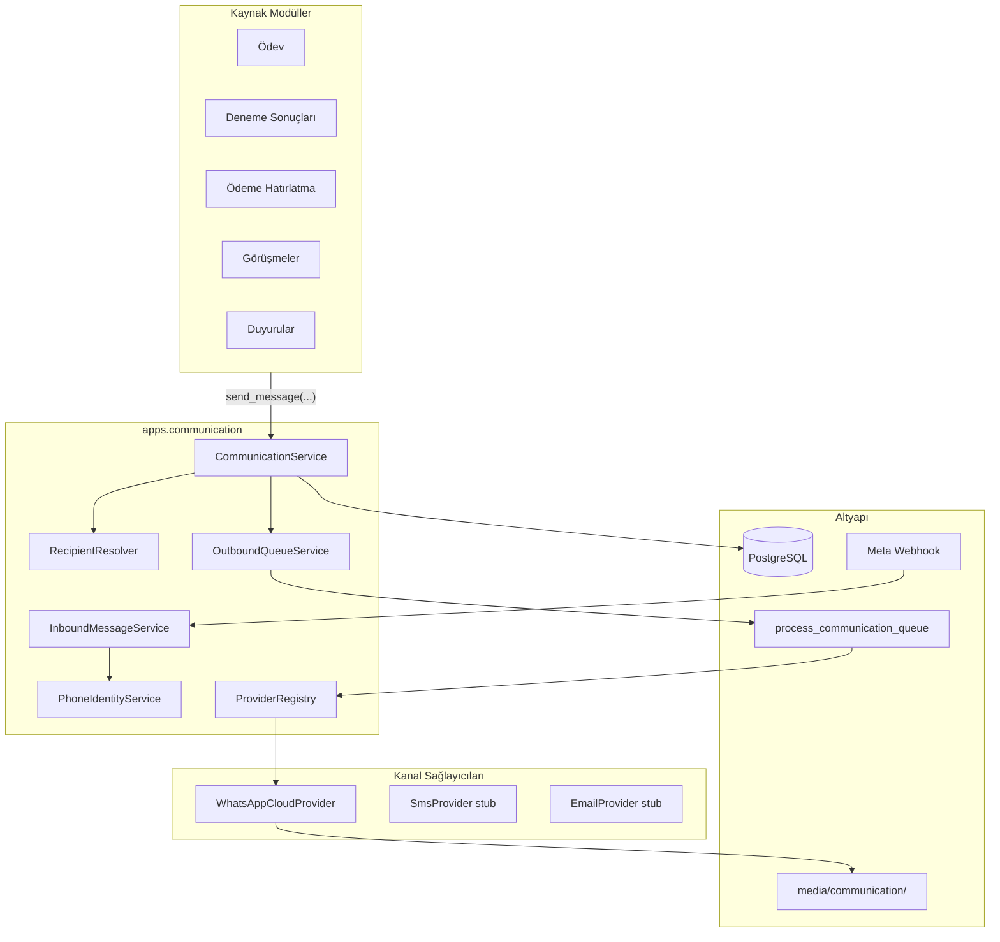
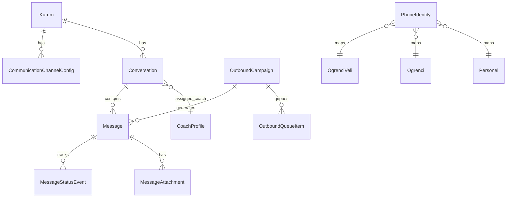
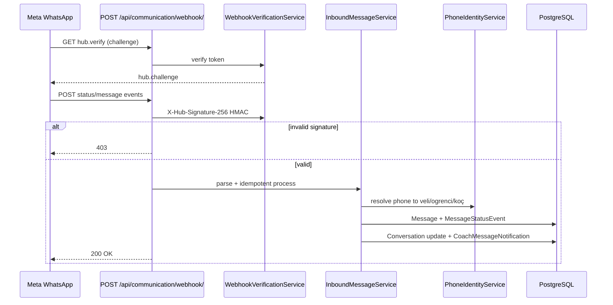

# 3K Kampüs — İletişim Merkezi & WhatsApp Business Cloud API Planı

## Özet

Meta WhatsApp Business Cloud API üzerinden öğrenci, veli ve koçlara mesaj gönderimi; gelen cevapların takibi; toplu gönderim kuyruğu; okundu/iletildi durumları ve raporlama — tamamı mevcut LMS içinde, kanal-bağımsız **Communication Service** katmanı üzerinden.

**Temel ilke:** Hiçbir modül doğrudan WhatsApp API çağırmaz. Tüm kanallar (WhatsApp → ileride SMS, E-posta, Push) `apps.communication` servis katmanından yürür.

**AI:** Normal akışta OpenAI kullanılmaz. Servis arayüzünde ileride isteğe bağlı `AiMessageAssistProvider` hook'u bırakılır.

---

## Mevcut Durum (Codebase)

| Alan | Durum |
|------|--------|
| Backend | Django 4.2, DDD katmanlı apps (`domain/`, `application/`, `infrastructure/`, `interfaces/`) |
| Kuyruk | Celery/Redis yok; `process_reminders` management command + cron pattern |
| Bildirim | `apps/takvim` — `NotificationChannel`: APP, SMS, EMAIL (SMS/EMAIL placeholder) |
| WhatsApp | Sadece frontend `wa.me` deep link (`PhoneContactLinks.tsx`) |
| Veli/Öğrenci | `OgrenciVeli.telefon`, `Ogrenci.telefon` — User hesabı yok |
| Koç scope | `apps/coaching/services/coach_access.py` |
| Multi-tenant | `kurum_id` FK + `shared/context.py` header/session |
| PDF | Çoğunlukla client-side (jsPDF); server-side: personel bordro (reportlab), makbuz JSON API |
| Frontend | Koç portalı `/coach/*`, admin AppShell, veli portalı yok |

---

## Mimari



### Katman Sorumlulukları

| Katman | Dizin | Sorumluluk |
|--------|-------|------------|
| Domain | `apps/communication/domain/` | Modeller, enum'lar, domain event'ler |
| Application | `apps/communication/application/` | CommunicationService, kuyruk, eşleştirme, raporlama |
| Infrastructure | `apps/communication/infrastructure/` | Repository, WhatsApp HTTP client, webhook parser, media storage |
| Interfaces | `apps/communication/interfaces/` | DRF views, webhook endpoint, serializers |
| Providers | `apps/communication/providers/` | `BaseChannelProvider`, `WhatsAppCloudProvider` |

### Public API (diğer modüller için)

```python
# apps/communication/application/communication_service.py
CommunicationService.send(
    kurum_id, channel=Channel.WHATSAPP,
    recipients=RecipientQuery(...),  # tek/çoklu/filtre
    content=MessageContent(text=..., attachment=...),
    source=MessageSource(module="odev", ref_id=123),
    sender_user_id=request.user.id,
)
CommunicationService.send_bulk(...)  # kampanya + onay
CommunicationService.retry_failed(campaign_id)
```

---

## Veri Modeli

### Enum'lar (`domain/enums.py`)

- **Channel:** `WHATSAPP`, `SMS`, `EMAIL`, `PUSH` (son üçü stub)
- **MessageType:** `TEXT`, `IMAGE`, `DOCUMENT`, `AUDIO`, `VIDEO`, `LOCATION`, `LINK`, `TEMPLATE`
- **MessageDirection:** `OUTBOUND`, `INBOUND`
- **MessageStatus:** `PENDING`, `SENDING`, `SENT`, `DELIVERED`, `READ`, `FAILED`, `CANCELLED`
- **RecipientType:** `OGRENCI`, `VELI`, `PERSONEL`, `RAW_PHONE`
- **ConversationStatus:** `OPEN`, `AWAITING_REPLY`, `ARCHIVED`
- **CampaignStatus:** `DRAFT`, `CONFIRMED`, `QUEUED`, `PROCESSING`, `COMPLETED`, `PARTIAL`, `CANCELLED`

### Ana modeller

| Model | Amaç | Önemli alanlar |
|-------|------|----------------|
| `CommunicationChannelConfig` | Kurum bazlı WABA ayarı | `kurum`, `channel`, `phone_number_id`, `waba_id`, `access_token_encrypted`, `webhook_verify_token`, `is_active` |
| `PhoneIdentity` | Tekilleştirilmiş telefon | `kurum`, `e164`, `ogrenci?`, `veli?`, `personel?`, `is_primary`, `verified_at` |
| `Conversation` | Konuşma thread'i | `kurum`, `channel`, `contact_phone`, `contact_type`, `ogrenci?`, `veli?`, `assigned_coach?`, `status`, `last_message_at`, `unread_count_coach` |
| `Message` | Tek mesaj | `conversation`, `campaign?`, `direction`, `message_type`, `body`, `status`, `provider_message_id`, `sender_user?`, `source_module`, `source_ref_id`, `failed_reason` |
| `MessageStatusEvent` | Durum geçmişi | `message`, `status`, `occurred_at`, `raw_payload` |
| `MessageAttachment` | Dosya | `message`, `file`, `mime_type`, `original_name`, `file_size`, `provider_media_id` |
| `OutboundCampaign` | Toplu gönderim | `kurum`, `channel`, `created_by`, `status`, `recipient_filter_json`, `preview_stats_json`, `total/sent/delivered/read/failed` |
| `OutboundQueueItem` | Kuyruk kaydı | `campaign?`, `message`, `priority`, `attempt_count`, `next_attempt_at`, `locked_at` |
| `CommunicationLog` | API/webhook log | `kurum?`, `direction`, `endpoint`, `http_status`, `request_body`, `response_body`, `error`, `duration_ms` |
| `CoachMessageNotification` | Koç anlık bildirim | `coach_user`, `conversation`, `message`, `read_at` |

### İlişkiler



### Telefon tekilleştirme

- `PhoneIdentityService.normalize(telefon) -> E.164` (TR: `+90...`)
- Aynı `kurum + e164` için tek kayıt; veli/öğrenci/personel FK'ları
- Kayıt/güncelleme: `ogrenci_kayit`, veli CRUD hook'larında sync (signal veya service call)

---

## WhatsApp Provider (`providers/whatsapp_cloud.py`)

Meta Cloud API sarmalayıcı — **tek giriş noktası**:

| İşlem | Meta endpoint |
|-------|----------------|
| Metin | `POST /{phone_number_id}/messages` type=text |
| Medya | upload media → document/image/video/audio |
| Konum | type=location |
| Link | text + preview (link in body) |
| Template | type=template (onaylı şablonlar) |
| Durum webhook | statuses: sent, delivered, read, failed |
| Gelen mesaj | messages webhook |

**Dosya tipleri:** PDF, Word, Excel → `type=document` + mime; resim/ses/video → ilgili type.

**Güvenlik:** Token `CommunicationChannelConfig` içinde şifreli (Fernet veya env-backed vault); log'larda token maskelenir.

---

## Webhook Akışı



**Endpoint:** `GET/POST /api/communication/webhook/` — CSRF exempt, imza doğrulama zorunlu.

**Idempotency:** `provider_message_id` + event type unique constraint.

**Kurum eşleme:** Webhook payload'daki `phone_number_id` → `CommunicationChannelConfig.kurum`.

---

## Kuyruk & Performans

Celery olmadan **Faz 1** (mevcut pattern):

```
management/commands/process_communication_queue.py
```

- Cron: her 30–60 sn
- `SELECT ... FROM OutboundQueueItem WHERE next_attempt_at <= now() FOR UPDATE SKIP LOCKED LIMIT N`
- Batch size: env `COMM_QUEUE_BATCH_SIZE=20` (Meta rate limit'e uygun)
- Retry: exponential backoff (1m, 5m, 15m, 1h); max 5 deneme
- `attempt_count`, `failed_reason` loglanır

**Faz 2 (opsiyonel):** Celery + Redis — aynı `OutboundQueueService` interface, worker swap.

---

## API Endpoint'leri

Base: `/api/communication/` → `config/urls.py` + frontend proxy `API_PREFIXED_PATHS`

### Konfigürasyon (Admin)

| Method | Path | Yetki |
|--------|------|-------|
| GET/PUT | `/config/whatsapp/` | `communication.manage` |
| POST | `/config/whatsapp/test/` | Bağlantı testi |

### Konuşmalar & Mesajlar

| Method | Path | Yetki |
|--------|------|-------|
| GET | `/conversations/` | coach: own scope / admin: all |
| GET | `/conversations/{id}/` | + mesaj listesi |
| POST | `/conversations/{id}/messages/` | Tekli gönder |
| PATCH | `/conversations/{id}/archive/` | Arşivle |
| PATCH | `/conversations/{id}/read/` | Okundu işaretle |
| GET | `/messages/search/` | Arama |

Query params: `status`, `unread`, `coach_id`, `sube_id`, `sinif_id`, `date_from`, `date_to`, `has_pdf`, `has_image`, `failed`

### Toplu gönderim

| Method | Path | Açıklama |
|--------|------|----------|
| POST | `/campaigns/preview/` | Alıcı sayıları + tahmini mesaj adedi |
| POST | `/campaigns/` | Oluştur (DRAFT) |
| POST | `/campaigns/{id}/confirm/` | Onay → kuyruğa al |
| GET | `/campaigns/{id}/` | Durum + rapor |
| POST | `/campaigns/{id}/retry-failed/` | Başarısızları tekrar |
| POST | `/campaigns/{id}/cancel/` | İptal |

Preview response örneği:
```json
{
  "total_recipients": 500,
  "ogrenci_count": 120,
  "veli_count": 380,
  "estimated_messages": 500,
  "invalid_phones": 3
}
```

### Alıcı çözümleme

| Method | Path |
|--------|------|
| POST | `/recipients/resolve/` | Filtre → telefon listesi |
| GET | `/recipients/coach-students/` | Koçun öğrencileri |
| GET | `/recipients/coach-parents/` | Koçun velileri |

### Dosyalar

| Method | Path |
|--------|------|
| GET | `/attachments/{id}/` | İndir |
| POST | `/attachments/{id}/resend/` | Aynı dosyayı tekrar gönder |

### Bildirimler (Koç)

| Method | Path |
|--------|------|
| GET | `/notifications/` | Okunmamış mesaj bildirimleri |
| PATCH | `/notifications/{id}/read/` | |
| GET | `/notifications/summary/` | Badge count (polling) |

### Webhook & Log

| Method | Path |
|--------|------|
| GET/POST | `/webhook/` | Meta (public, imzalı) |
| GET | `/logs/` | Admin API/webhook logları |

### Modül entegrasyon hook'ları (internal)

| Modül | Trigger | Servis çağrısı |
|-------|---------|----------------|
| Ödev | Atama / rapor | `send(document=odev_pdf)` |
| Deneme | Sonuç yayın | `send_bulk(filter=sinif)` |
| Ödeme | Vade yaklaşınca | `send(text=hatirlatma)` |
| Görüşme | Hatırlatma | `send(text=...)` |
| Devamsızlık | Kayıt | `send(text=...)` |
| Duyuru | Yayın | `send_bulk(...)` |

PDF hook stratejisi:
1. **Kısa vadede:** Server-side PDF üretim servisi (`PdfRenderService`) — makbuz JSON, bordro reportlab pattern
2. **Geçiş:** Client PDF → upload endpoint → `MessageAttachment` → send

---

## Yetkilendirme (RBAC)

`apps/roller/seed.py` yeni izinler:

- `communication.read`
- `communication.write`
- `communication.manage` (config, tüm konuşmalar, log)
- `communication.bulk` (toplu gönderim)

**Koç:** `coach_access.scoped_student_ids()` ile conversation/message queryset filtresi; sadece atanmış öğrenci/veli.

**Admin:** `communication.manage` → tüm kurum konuşmaları.

DRF permission: `CommunicationPermission` + `CoachScopedMixin`.

---

## Frontend Planı

### Yeni dosyalar

```
frontend/
  lib/messaging-api.ts          # API client (gorusme-api.ts pattern)
  components/messaging/
    InboxClient.tsx             # Konuşma listesi (WhatsApp benzeri)
    ThreadPanel.tsx             # Mesaj balonları
    ComposeBar.tsx              # Metin + dosya ekle
    BulkSendDrawer.tsx          # BulkGorusmeDrawer pattern
    CampaignPreviewModal.tsx    # Onay öncesi istatistik
    MessageStatusBadge.tsx
    AttachmentPreview.tsx
    MessagingFilters.tsx
  app/coach/mesajlar/
    page.tsx
    MesajlarClient.tsx
  app/admin/iletisim/
    mesajlar/page.tsx
    toplu-gonder/page.tsx
    ayarlar/page.tsx            # WABA config
  components/coach/student360/MesajlarTab.tsx
  app/ogrenciler/[id]/components/tabs/WhatsAppTab.tsx
```

### Route'lar

| Route | Kullanıcı | Özellik |
|-------|-----------|---------|
| `/coach/mesajlar` | Koç | Inbox: Konuşmalar, Okunmamış, Cevap Bekleyen, Arşiv |
| `/admin/iletisim/mesajlar` | Admin | Tüm konuşmalar + filtre/arama |
| `/admin/iletisim/toplu-gonder` | Admin/Koç | Toplu gönderim + rapor |
| `/admin/iletisim/ayarlar` | Admin | WABA yapılandırma |
| `/coach/ogrenciler/[id]?tab=mesajlar` | Koç | Öğrenci mesaj geçmişi |
| `/ogrenciler/[id]` → WhatsApp sekmesi | Admin | Tam geçmiş |

### Nav güncellemeleri

- [`coachNavItems.tsx`](frontend/components/coach/coachNavItems.tsx): `{ id: "mesajlar", href: "/coach/mesajlar", label: "Mesajlar" }`
- [`Sidebar.tsx`](frontend/components/layout/Sidebar.tsx): "İletişim" grubu
- [`route.ts`](frontend/app/api/[...path]/route.ts): `'communication'` → `API_PREFIXED_PATHS`

### UI pattern'leri

- **Inbox:** Sol panel konuşma listesi + sağ panel thread (responsive: mobilde stack)
- **Bulk send:** [`BulkGorusmeDrawer.tsx`](frontend/components/coach/BulkGorusmeDrawer.tsx) — seçim, preview modal, confirm
- **Bildirim:** [`NotificationBell.tsx`](frontend/components/notification/NotificationBell.tsx) pattern → `CoachTopbar`'a polling (30s), okunana kadar badge kalır
- **Veli hızlı erişim:** [`PhoneContactLinks.tsx`](frontend/components/coach/PhoneContactLinks.tsx) — wa.me yerine in-app thread aç

### Veli / Öğrenci portalı

Mevcut yok. **Faz 3:** `/veli/mesajlar`, `/ogrenci/mesajlar` — aynı `InboxClient`, auth modeli ayrı tasarlanır (telefon OTP veya davet linki).

---

## AI Hook (gelecek, zorunlu değil)

```python
# apps/communication/application/ai_providers.py
class AiMessageAssistProvider(Protocol):
    def suggest_reply(self, conversation_id, context) -> str: ...
    def draft_message(self, intent, recipient) -> str: ...
    def summarize_thread(self, conversation_id) -> str: ...

# Default: NullAiProvider (no-op)
# Future: OpenAiAssistProvider — settings flag ile aktif
```

Normal `CommunicationService.send()` bu provider'ı **çağırmaz**.

---

## Uygulama Fazları

### Faz 0 — Altyapı (1–2 hafta)

- [ ] `apps/communication` app scaffold + `INSTALLED_APPS`
- [ ] Domain modeller + migrations
- [ ] `PhoneIdentityService`, `CommunicationLog`
- [ ] RBAC seed permissions
- [ ] Env: `WHATSAPP_*`, queue batch settings
- [ ] Celery'siz queue command iskelet

### Faz 1 — WhatsApp Outbound (2–3 hafta)

- [ ] `WhatsAppCloudProvider` (text, document, image)
- [ ] `CommunicationService.send()` tekli gönderim
- [ ] Webhook: status updates (sent/delivered/read/failed)
- [ ] Admin WABA config UI + test endpoint
- [ ] Koç tekli mesaj: compose from student/veli card

### Faz 2 — Inbound + Mesaj Merkezi (2–3 hafta)

- [ ] Webhook: inbound messages
- [ ] Phone → veli/öğrenci/koç eşleştirme
- [ ] `/coach/mesajlar` Inbox UI
- [ ] Coach notifications (polling)
- [ ] Öğrenci/veli WhatsApp sekmeleri

### Faz 3 — Toplu Gönderim & Rapor (2 hafta)

- [x] Campaign preview/confirm/queue
- [x] `process_communication_queue` production cron
- [x] Retry failed + campaign report UI
- [x] Admin bulk send + filtreler

#### Toplu Gönderim Stüdyosu

Hibrit akış: **Adım 1 — Alıcı seçimi** (radio kartlar, canlı mini özet) → **Adım 2 — 3 panelli stüdyo** (alıcı özeti | zengin editör + ekler | WhatsApp telefon mock) → **Onay modalı** (istatistik tablosu + maliyet tahmini).

| Bileşen | Konum |
|---------|--------|
| Admin stüdyo | `/admin/iletisim/toplu-gonder` |
| Koç stüdyo | `/coach/toplu-gonder` (yalnızca `coach_students` / `coach_parents`) |
| Şablon yönetimi | `/admin/iletisim/sablonlar` |

**Backend:** `MessageTemplate`, `CampaignAttachment`, genişletilmiş `OutboundCampaign` (`scheduled_at`, `estimated_cost_usd`, `template` FK). API: `/templates/`, `/attachments/upload/`, genişletilmiş `/campaigns/preview/` (maliyet, ek sayısı). Zamanlanmış gönderim: `process_scheduled_campaigns` management command.

**Maliyet tahmini:** `COMMUNICATION_WHATSAPP_COST_USD` (varsayılan ~0.0009) × tahmini mesaj adedi.

**Değişken çözümleme:** UI'da `resolvePreviewVariables()` demo; gönderim anında `variable_resolver.resolve_variables()` kişi bazlı substitute eder.

**Koç yetkisi:** `communication.bulk` koç rolüne atanır; kampanya API coach scope ile `coach_students` / `coach_parents` kısıtlı.

### Faz 4 — Modül Entegrasyonları (2–3 hafta)

- [ ] Ödeme hatırlatma
- [ ] Ödev/deneme PDF server render + send
- [ ] Görüşme hatırlatma
- [ ] Devamsızlık / duyuru hook'ları

### Faz 5 — Gelişmiş (opsiyonel)

- [ ] Celery + Redis migration
- [ ] SMS/Email provider stub → gerçek implementasyon
- [ ] Veli/Öğrenci portal mesajları
- [ ] AI assist provider
- [ ] SSE/WebSocket real-time (polling yerine)

---

## Test Senaryoları

### Backend unit

| # | Senaryo | Beklenen |
|---|---------|----------|
| T1 | `PhoneIdentityService.normalize("0532...")` | `+90532...` |
| T2 | Aynı telefon iki veliye atanamaz (aynı kurum) | ValidationError |
| T3 | `send()` koç scope dışı öğrenci | 403 |
| T4 | Webhook invalid HMAC | 403, log kaydı |
| T5 | Duplicate webhook event | Idempotent, tek MessageStatusEvent |
| T6 | Queue item 3 fail → retry backoff | attempt_count artar |
| T7 | Campaign preview filtre | doğru ogrenci/veli sayısı |
| T8 | Cancel campaign | PENDING mesajlar CANCELLED |

### Backend integration

| # | Senaryo |
|---|---------|
| I1 | End-to-end outbound text → webhook delivered → status DELIVERED |
| I2 | Inbound veli cevabı → conversation oluşur → coach notification |
| I3 | Bulk 100 mesaj queue → batch processing → campaign report |
| I4 | PDF attachment upload → WhatsApp document send |
| I5 | Retry failed campaign → sadece FAILED yeniden kuyruğa |

### Frontend E2E

| # | Senaryo |
|---|---------|
| E1 | Koç inbox: unread filter, thread aç, cevap yaz |
| E2 | Bulk send: preview stats → confirm → progress |
| E3 | Öğrenci WhatsApp sekmesi: geçmiş mesaj + PDF |
| E4 | Admin: tüm konuşmalar arama (telefon/ad) |
| E5 | Coach notification badge: yeni mesaj → oku → badge düşer |

### Güvenlik

| # | Senaryo |
|---|---------|
| S1 | Koç A, Koç B'nin conversation'ını göremez |
| S2 | Webhook verify token mismatch → challenge reddedilir |
| S3 | Token log'larda maskelenir |

---

## Oluşturulacak Dosyalar (özet)

### Backend (~45 dosya)

```
backend/apps/communication/
  apps.py
  domain/models.py, enums.py
  application/
    communication_service.py
    recipient_resolver.py
    outbound_queue_service.py
    inbound_message_service.py
    phone_identity_service.py
    campaign_service.py
    webhook_verification_service.py
    pdf_render_service.py          # modül PDF'leri
    ai_providers.py                # null impl
  infrastructure/
    repositories.py
    media_storage.py
  providers/
    base.py
    whatsapp_cloud.py
  interfaces/
    urls.py, serializers.py
    views/conversations.py, campaigns.py, webhook.py, config.py, notifications.py
  management/commands/process_communication_queue.py
  tests/
    test_phone_identity.py
    test_webhook.py
    test_queue.py
    test_coach_scope.py
    test_campaign.py
```

### Frontend (~20 dosya)

Yukarıdaki `components/messaging/`, route'lar, `lib/messaging-api.ts`, tab genişletmeleri.

### Config

- `backend/config/urls.py` — `path('api/communication/', include(...))`
- `backend/config/settings/base.py` — `COMMUNICATION_*` settings
- `requirements.txt` — `cryptography` (token encrypt), opsiyonel `celery/redis`
- `frontend/app/api/[...path]/route.ts` — `communication` prefix

---

## Riskler & Kararlar

| Risk | Mitigasyon |
|------|------------|
| Meta rate limit | Queue batch size + backoff |
| PDF client-side | Server PdfRenderService; öncelik makbuz/bordro |
| Celery yok | DB queue + cron (Faz 1); Celery Faz 5 |
| Veli User yok | PhoneIdentity + coach/admin inbox; veli portal sonra |
| Token güvenliği | Encrypted at rest, env rotation |
| OpenAI karışması | Strict service boundary + NullAiProvider default |

---

## Teslim Raporu Şablonu (implementasyon sonrası)

1. Oluşturulan dosya listesi
2. Migration / model değişiklikleri
3. API endpoint dokümantasyonu (OpenAPI veya tablo)
4. Webhook akış diyagramı + Meta App setup adımları
5. Kullanıcı akışları (koç/admin/veli)
6. Test sonuçları (unit + integration)
7. Cron/kuyruk operasyon notları
8. Bilinen kısıtlar ve Faz 5 backlog
