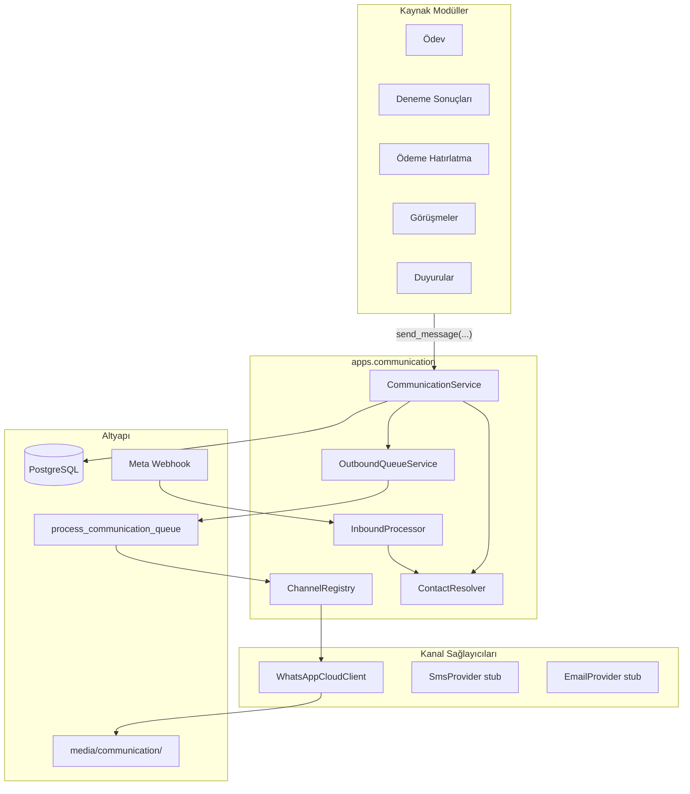
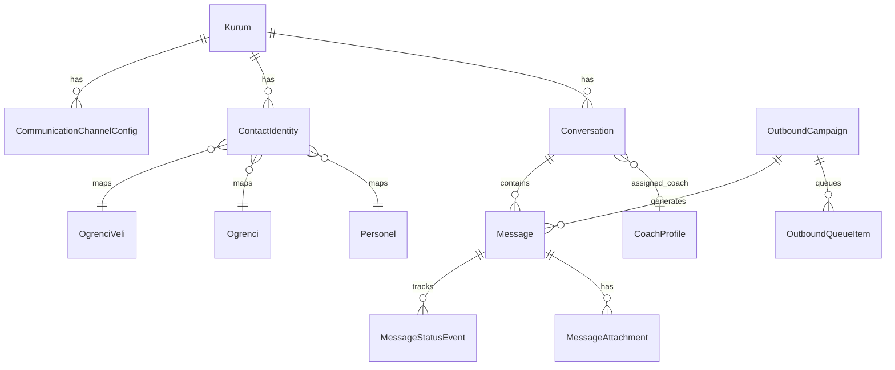
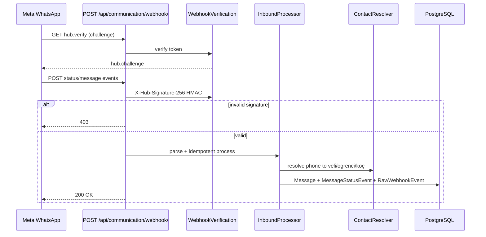

# WhatsApp Business Cloud API — Entegrasyon Analiz Raporu

**Proje:** 3K Kampüs LMS  
**Tarih:** Haziran 2026  
**Kapsam:** Meta WhatsApp Business Cloud API ile kanal-bağımsız İletişim Merkezi  
**Detay plan:** [`whatsapp-communication-center.md`](./whatsapp-communication-center.md)

---

## 1. Yönetici Özeti

Mevcut LMS'te WhatsApp yalnızca frontend `wa.me` deep link ile kullanılmaktadır. Öğrenci, veli ve koçlara kurum içinden mesaj gönderimi, gelen cevapların takibi, durum (iletildi/okundu) izleme ve toplu gönderim kuyruğu için **yeni `apps.communication` Django uygulaması** önerilmektedir.

**Temel strateji:** Hiçbir iş modülü (ödev, deneme, ödeme vb.) doğrudan Meta API çağırmaz. Tüm kanallar tek bir **Communication Service** katmanından yürür; WhatsApp ilk gerçek implementasyon, SMS/E-posta/Push ileride stub'tan genişletilir.

**AI:** Normal mesaj akışında OpenAI kullanılmaz. İleride isteğe bağlı `AiMessageAssistProvider` hook'u bırakılır (varsayılan: no-op).

---

## 2. Mevcut Durum Analizi

| Alan | Durum | Etki |
|------|--------|------|
| Backend mimarisi | Django 4.2, DDD katmanlı apps (`domain/`, `application/`, `infrastructure/`, `interfaces/`) | `finans` / `takvim` pattern'i kopyalanabilir |
| Kuyruk altyapısı | Celery/Redis yok | `process_reminders` benzeri management command + cron |
| Bildirim | `apps/takvim` — APP/SMS/EMAIL kanalları (SMS/EMAIL placeholder) | Kanal soyutlaması örneği mevcut |
| WhatsApp | Sadece `PhoneContactLinks.tsx` → `wa.me` | In-app thread, durum takibi yok |
| Veli/Öğrenci auth | Telefon alanları var; veli User hesabı yok | `ContactIdentity` + koç/admin inbox öncelikli |
| Multi-tenant | `kurum_id` FK + `X-Kurum-ID` header/session | Tüm modeller kurum scoped |
| Koç erişimi | `coach_access.scoped_student_ids()` | Conversation queryset filtresi |
| PDF | Çoğunlukla client-side | Server-side render Faz 4'te |

---

## 3. Önerilen Mimari (`apps.communication`)

### 3.1 Katman Sorumlulukları

| Katman | Dizin | Sorumluluk |
|--------|-------|------------|
| Domain | `domain/models.py`, `domain/enums.py` | Modeller, enum'lar, iş kuralları |
| Application | `application/` | `CommunicationService`, `ContactResolver`, `InboundProcessor`, kuyruk |
| Infrastructure | `infrastructure/channels/`, `repository.py` | WhatsApp HTTP client, webhook parser, persistence |
| Interfaces | `interfaces/views/`, `interfaces/serializers/` | DRF API, webhook endpoint |
| Management | `management/commands/` | `process_communication_queue` |

### 3.2 Mimari Diyagram



### 3.3 Public Servis Arayüzü (diğer modüller)

```python
CommunicationService.send(
    kurum_id, channel=Channel.WHATSAPP,
    recipients=RecipientQuery(...),
    content=MessageContent(text=..., attachment=...),
    source=MessageSource(module="odev", ref_id=123),
    sender_user_id=request.user.id,
)
CommunicationService.send_bulk(...)   # kampanya + onay
CommunicationService.retry_failed(campaign_id)
```

---

## 4. Veri Modeli

### 4.1 Enum'lar

- **Channel:** `WHATSAPP`, `SMS`, `EMAIL`, `PUSH`
- **MessageType:** `TEXT`, `IMAGE`, `DOCUMENT`, `AUDIO`, `VIDEO`, `LOCATION`, `LINK`, `TEMPLATE`
- **MessageDirection:** `OUTBOUND`, `INBOUND`
- **MessageStatus:** `PENDING`, `SENDING`, `SENT`, `DELIVERED`, `READ`, `FAILED`, `CANCELLED`
- **RecipientType:** `OGRENCI`, `VELI`, `PERSONEL`, `RAW_PHONE`
- **ConversationStatus:** `OPEN`, `AWAITING_REPLY`, `ARCHIVED`
- **CampaignStatus:** `DRAFT`, `CONFIRMED`, `QUEUED`, `PROCESSING`, `COMPLETED`, `PARTIAL`, `CANCELLED`

### 4.2 Ana Modeller

| Model | Amaç |
|-------|------|
| `CommunicationChannelConfig` | Kurum bazlı WABA ayarı (phone_number_id, waba_id, token, verify_token) |
| `ContactIdentity` | Tekilleştirilmiş telefon → öğrenci/veli/personel eşlemesi |
| `Conversation` | Konuşma thread'i, koç ataması, okunmamış sayacı |
| `Message` | Tek mesaj, kaynak modül referansı, provider_message_id |
| `MessageStatusEvent` | Durum geçmişi (idempotent webhook) |
| `MessageAttachment` | Dosya/medya |
| `OutboundCampaign` | Toplu gönderim kampanyası |
| `OutboundQueueItem` | DB kuyruk kaydı |
| `CommunicationLog` | API/webhook audit log |
| `RawWebhookEvent` | Ham webhook payload (debug/replay) |

### 4.3 ER Diyagram



### 4.4 Telefon Tekilleştirme

- `ContactResolver.normalize(telefon) → E.164` (TR: `+90532...`)
- Unique: `(kurum_id, e164)` — aynı numara iki veliye atanamaz
- Sync hook: `ogrenci_kayit`, veli CRUD (Faz 2+)

---

## 5. WhatsApp Kanalı

Meta Cloud API sarmalayıcı — **tek HTTP giriş noktası** (`infrastructure/channels/whatsapp_cloud.py`):

| İşlem | Meta endpoint |
|-------|----------------|
| Metin | `POST /{phone_number_id}/messages` type=text |
| Medya | upload → document/image/video/audio |
| Template | type=template |
| Durum webhook | statuses: sent, delivered, read, failed |
| Gelen mesaj | messages webhook |

**Güvenlik:** Token `CommunicationChannelConfig` + env fallback; log'larda maskelenir. Webhook: `X-Hub-Signature-256` HMAC zorunlu.

**Env değişkenleri (dev):**

| Değişken | Açıklama |
|----------|----------|
| `WHATSAPP_PHONE_NUMBER_ID` | Meta phone number ID |
| `WHATSAPP_WABA_ID` | WhatsApp Business Account ID |
| `WHATSAPP_ACCESS_TOKEN` | System user token |
| `WHATSAPP_VERIFY_TOKEN` | Webhook doğrulama |
| `WHATSAPP_APP_SECRET` | HMAC imza doğrulama |
| `COMM_QUEUE_BATCH_SIZE` | Kuyruk batch (varsayılan 20) |

---

## 6. Webhook Akışı



**Kurum eşleme:** Payload `phone_number_id` → `CommunicationChannelConfig.kurum_id`

**Idempotency:** `provider_message_id` + event type unique constraint

---

## 7. Kuyruk & Performans

Celery olmadan Faz 1 pattern:

```
management/commands/process_communication_queue.py
```

- Cron: her 30–60 sn
- `SELECT ... FROM OutboundQueueItem WHERE next_attempt_at <= now() FOR UPDATE SKIP LOCKED LIMIT N`
- Retry: exponential backoff (1m, 5m, 15m, 1h); max 5 deneme
- Meta rate limit: `COMM_QUEUE_BATCH_SIZE=20`

**Faz 5 (opsiyonel):** Celery + Redis — aynı servis arayüzü, worker swap.

---

## 8. API Endpoint Özeti

Base: `/api/communication/` (auth) + `/api/communication/webhook/` (public, imzalı)

| Grup | Endpoint | Yetki |
|------|----------|-------|
| Config | `GET/PUT /config/whatsapp/` | `communication.config` / `manage` |
| Config | `POST /config/whatsapp/test/` | `communication.config` |
| Konuşmalar | `GET /conversations/` | `communication.read` + koç scope |
| Mesajlar | `GET/POST /conversations/{id}/messages/` | read / write |
| Kampanya | `POST /campaigns/preview/` | `communication.write` (stub Faz 1) |
| Webhook | `GET/POST /webhook/` | Public (Meta) |
| Log | `GET /logs/` | `communication.manage` |

Frontend proxy: `API_PREFIXED_PATHS` → `'communication'`

---

## 9. Yetkilendirme (RBAC)

Yeni izinler (`apps/roller/seed.py`):

| Kod | Açıklama |
|-----|----------|
| `communication.read` | Konuşma/mesaj görüntüleme |
| `communication.write` | Mesaj gönderme |
| `communication.manage` | Tüm kurum konuşmaları, log |
| `communication.config` | WABA yapılandırma |

**Koç:** `coach_access.scoped_student_ids()` ile queryset filtresi  
**Admin:** `communication.manage` → tüm kurum  
**DRF:** `CommunicationModulePermission` + `CommunicationConfigPermission`

---

## 10. Dosya Değişiklikleri (Faz 0–1)

### Backend (yeni)

```
backend/apps/communication/
  apps.py, models.py, api_urls.py, webhook_urls.py, permissions.py
  domain/models.py, domain/enums.py
  application/communication_service.py, contact_resolver.py, inbound_processor.py
  infrastructure/channels/base.py, whatsapp_cloud.py, repository.py
  interfaces/serializers/, interfaces/views/
  management/commands/process_communication_queue.py
  tests/, migrations/
```

### Backend (güncelleme)

| Dosya | Değişiklik |
|-------|------------|
| `config/settings/base.py` | `INSTALLED_APPS`, `WHATSAPP_*`, `COMM_*` |
| `config/urls.py` | `api/communication/`, webhook path |
| `shared/permissions.py` | `CommunicationModulePermission` |
| `apps/roller/seed.py` | communication.* izinleri, rol atamaları |

### Frontend (Faz 1 scaffold)

| Dosya | Açıklama |
|-------|----------|
| `lib/communication-api.ts` | API client |
| `app/coach/mesajlar/` | Koç inbox placeholder |
| `app/admin/iletisim/ayarlar/` | WABA config UI |
| `coachNavItems.tsx`, `Sidebar.tsx` | Nav girişleri |
| `app/api/[...path]/route.ts` | `communication` prefix |

---

## 11. Uygulama Fazları

| Faz | Süre | Kapsam |
|-----|------|--------|
| **Faz 0** | 1–2 hf | App scaffold, modeller, RBAC, queue command iskelet |
| **Faz 1** | 2–3 hf | WhatsApp outbound stub, config UI, webhook status iskelet |
| **Faz 2** | 2–3 hf | Inbound, inbox UI, koç bildirimleri |
| **Faz 3** | 2 hf | Toplu gönderim, kampanya raporu |
| **Faz 4** | 2–3 hf | Modül hook'ları (ödev, deneme, ödeme) |
| **Faz 5** | opsiyonel | Celery, SMS/Email, veli portal, AI assist, SSE |

**Faz 1'de yapılmayanlar:** Gerçek Meta production send, bulk UI, modül hook'ları, Celery, AI.

---

## 12. Riskler & Mitigasyon

| Risk | Olasılık | Etki | Mitigasyon |
|------|----------|------|------------|
| Meta rate limit | Yüksek | Orta | Queue batch + backoff |
| Token sızıntısı | Orta | Yüksek | Encrypted at rest, log masking |
| Veli User yok | Kesin | Orta | PhoneIdentity + admin/koç inbox; portal Faz 3 |
| PDF client-side | Yüksek | Orta | Server PdfRenderService Faz 4 |
| Celery yok | Kesin | Düşük | DB queue + cron (yeterli Faz 1–3) |
| Webhook duplicate | Orta | Düşük | Idempotent status events |
| Koç scope ihlali | Orta | Yüksek | Queryset filtresi + integration test |

---

## 13. Test Stratejisi

### Backend unit (Faz 1)

| # | Senaryo |
|---|---------|
| T1 | `ContactResolver.normalize("0532...")` → `+90532...` |
| T2 | Aynı telefon iki veliye (aynı kurum) → ValidationError |
| T3 | Permission: koç `communication.read` vs config |
| T4 | Webhook invalid HMAC → 403 |
| T5 | Queue dry-run → pending count |

### Integration (Faz 2+)

- Outbound text → webhook delivered → status DELIVERED
- Inbound veli → conversation + coach notification
- Bulk 100 mesaj → campaign report

---

## 14. Meta App Kurulum Notları (prod test için)

1. Meta Developer Console → WhatsApp Business App oluştur
2. System User token + `phone_number_id`, `waba_id` al
3. Webhook URL: `https://<domain>/api/communication/webhook/`
4. Verify token: env `WHATSAPP_VERIFY_TOKEN` ile eşleştir
5. Subscribe: `messages`, `message_template_status_update` (statuses)
6. Kurum admin panelinden veya env ile config kaydet

---

## 15. Sonuç & Öneri

WhatsApp entegrasyonu mevcut LMS mimarisine **DDD katmanlı yeni modül** olarak en düşük riskle eklenebilir. Celery zorunlu değildir; `takvim.process_reminders` pattern'i yeterlidir. İlk teslim (Faz 0–1): modeller, API iskelet, RBAC, frontend scaffold ve stub provider — Meta credentials olmadan da unit test ve UI geliştirmesi mümkündür.

**Sonraki adım:** Faz 1 tamamlandıktan sonra Meta sandbox credentials ile webhook + outbound smoke test.
